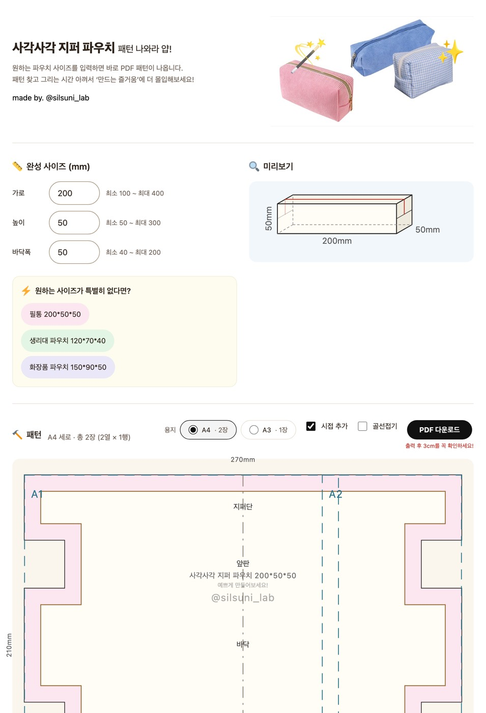
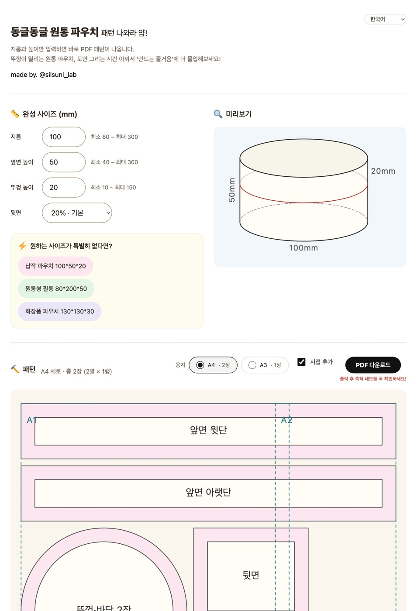

# 파우치 도안 생성기

완성 치수를 입력하면 파우치 전개도를 1:1 실치수 PDF로 만들어주는 정적 웹 도구. 두 가지를 만든다.

- **사각사각 지퍼 파우치** — 가로·높이·바닥폭 → **https://silsuni-lab.github.io/**
- **동글동글 원통 파우치** — 지름·옆면 높이·뚜껑 높이 → **https://silsuni-lab.github.io/round-pouch-test/** ([계산](#원통-파우치)) · *시험 중*

> **원통 파우치는 아직 시험 중이다.** 사각 페이지에서 이리로 오는 안내 줄을 빼 두었고, 검색엔진에도 올리지 않으며, 다운로드 기록도 남기지 않는다. 주소를 치면 열리므로 잠근 것은 아니다.
>
> 공개할 때 되돌릴 것 셋 — 셋은 늘 같이 움직인다.
>
> 1. `index.html`의 `other-kind` 주석 풀기
> 2. `round-pouch-test/index.html`의 `noindex` 한 줄 지우기
> 3. `round-pouch-test/main.ts`의 `trackDownload` 주석 풀고 import 되살리기 — **그 전에 Apps Script에 `종류` 열부터 넣을 것**([다운로드 기록](#다운로드-기록))
>
> 되돌린 뒤에는 스크린샷도 다시 찍는다(사각 화면에 링크 한 줄이 는다).



설치할 것도, 가입할 것도 없다. 브라우저에서 치수를 넣고 PDF를 받아 100%로 인쇄하면 그대로 재단하면 된다. 시접 10mm가 이미 포함되어 있다.

두 종류가 인쇄 방식·시접·여러 장 이어 붙이기를 그대로 함께 쓴다. 아래 설명은 종류를 따로 적지 않은 한 둘 다에 해당한다.

<details>
<summary><b>In English</b></summary>

## Pouch Sewing Pattern Generator

A static web tool that turns finished dimensions into a print-ready, true-to-scale PDF sewing pattern. Two kinds:

- **Boxy zipper pouch** — width, height, depth. → **https://silsuni-lab.github.io/**
- **Round pouch with a hinged lid** — diameter, side height, lid height. → **https://silsuni-lab.github.io/round-pouch-test/**

Enter the dimensions in millimetres. The tool drafts the flat pattern, tiles it across A4 or A3 sheets and hands you a PDF to print at 100&nbsp;% scale. A 10&nbsp;mm seam allowance is included by default. Both kinds share the same printing, seam allowance and multi-sheet assembly.

**What it does for you**

- **True scale, verified.** Two red test squares are printed on the first sheet — one 30&nbsp;mm (3&nbsp;cm), one 1&nbsp;inch. Measure whichever suits your ruler; if it matches, every other measurement is right.
- **Multi-sheet assembly.** Neighbouring sheets overlap by 10&nbsp;mm. Cut along the dashed line on the left and top edges, then slide each sheet until the red diamonds line up and tape.
- **Seam allowance is optional.** On by default. Turn it off and the pattern comes out at finished size, for when you prefer to add the allowance by hand as you cut. The sheet is then labelled `시접없음` (*no seam allowance*) and the file gets a `-noseam` suffix, so a stray printout can never be mistaken for the other kind.
- **Half-size printing** *(boxy pouch only)*. The pattern is symmetric about the middle of the base, so you can print only the top half and place the marked fold edge on folded fabric. Roughly halves the number of sheets.
- **The round pouch hinge is a ratio, not a length.** The back panel carries no zipper, so it becomes the hinge between lid and body. 80&nbsp;mm of back panel is 19.6&nbsp;% of the circumference at Ø130 but 50.9&nbsp;% at Ø50 — where the lid no longer opens at all. Taking it as a share of the circumference (10–30&nbsp;%) keeps the meaning intact at every diameter.
- **Legend lists only what was drawn.** In the *printed* pattern, cut line, stitch line, fold line, centre line, fold edge and assembly marks each get their own colour *and* dash pattern. The on-screen preview draws cut, stitch and centre lines in one weight and one colour instead — the pink seam band already shows which side is which, and the centre line is a dash-dot. Either way, turn a feature off and its legend entry disappears with it — you never hunt the drawing for a line that isn't there.

**Runs entirely in your browser.** No account, no upload, no server. Your measurements never leave the page. Fonts and icons are bundled, so nothing is fetched from a third party.

The interface is available in five languages — Korean, English, Traditional Chinese, Simplified Chinese and Japanese. Korean sits at the site root; the others are at `/en/`, `/zh-TW/`, `/zh-CN/` and `/ja/`. Pick one from the language dropdown in the top-right corner of any page; the pattern PDF comes out in that language too. Most of the printed pattern is lines and numbers, and the labels gloss as — boxy pouch: 지퍼단 *zipper band*, 앞판 *front*, 바닥 *base*, 뒤판 *back*, 골선 *place on fold*; round pouch: 앞면 윗단 *front upper band*, 앞면 아랫단 *front lower band*, 뒷면 *back*, 뚜껑·바닥 *lid and base circles*.

Code is MIT licensed. **Patterns you generate are yours** — there are no restrictions on the output.

</details>

## 쓰는 법

```bash
npm install
npm run dev      # 개발 서버
npm test         # 테스트
npm run build    # dist/ 생성
```

`dist/`를 정적 호스팅에 그대로 올리면 된다. 하위 경로(`example.com/pouch/`)에 올려도 동작한다.

## 언어

다섯 언어로 나간다. 한국어가 뿌리(`/`)이고 나머지는 한 단계 아래다.

| 언어 | 경로 |
|---|---|
| 한국어 | `/` |
| English | `/en/` |
| 中文(繁體) | `/zh-TW/` |
| 中文(简体) | `/zh-CN/` |
| 日本語 | `/ja/` |

오른쪽 위 드롭다운에서 고르면 그 언어 페이지로 옮겨 간다. 화면만이 아니라 PDF 도안의
문구도 그 언어로 나오고, 다운로드 기록에도 어느 언어 페이지인지 함께 남는다.

## 축척 확인

첫 도안 장 오른쪽 위에 빨간 네모가 **둘** 인쇄된다. 왼쪽이 1인치(25.4mm), 오른쪽이 30mm(3cm)다. 자기 자에 맞는 쪽을 재서 눈금과 맞으면 나머지 치수도 전부 맞다.

둘 다 찍는 까닭이 있다. 하나만 있으면 다른 자를 쓰는 사람은 눈금 사이를 눈대중해야 하고, 그러면 축척이 어긋났는지 맞았는지를 못 가린다 — 둘 다 찍으면 그런 경우가 없다.

화면과 입력은 mm 하나로만 말한다.

## 사각 파우치 계산

시접 `S`=10mm, 지퍼 차감 `Z`=10mm. 도안 치수에 시접이 포함되어 있어 그대로 재단한다. 두 상수는 [원통 파우치](#원통-파우치)도 같은 값을 쓴다.

**시접은 끌 수 있다.** 용지 선택 옆의 **시접 추가** 체크박스를 끄면 `S`=0으로 계산해 완성 치수 그대로 뜬다. 재단하면서 손으로 시접을 더하거나, 완성선을 따라 그릴 도안이 필요할 때 쓴다. 이때 완성선은 재단선과 같은 자리가 되므로 겹쳐 긋지 않고, 범례에서도 그 두 줄이 빠진다.

기본은 켜짐이다. 무심코 시접 없는 도안을 뽑아 원단을 버리는 일을 막는다. 그래도 종이만 따로 돌아다닐 수 있으니 도안 이름에 `시접없음`을 붙이고 파일명에도 `-noseam`을 단다. 여기까지는 두 종류가 똑같이 군다. 아래 밴드 표부터가 사각 파우치 것이다.

| 밴드 | 폭 | 높이 |
|---|---|---|
| 윗단(지퍼단) | `W + H + 2S` | `D/2 − Z/2 + 2S` |
| 앞판 | `W + 2S` | `H − 2S` |
| 바닥 | `W + H + 2S` | `D + 2S` |
| 뒤판 | `W + 2S` | `H − 2S` |
| 윗단(지퍼단) | `W + H + 2S` | `D/2 − Z/2 + 2S` |

전체 크기는 `W + H + 2S` × `2D + 2H − Z + 2S`. 앞판·뒤판이 좌우로 `H/2`씩 들어가며, 그 부분이 접혀 옆면이 된다.

**접힘선은 재단선이 아니라 완성선을 기준으로 잡는다.** 위 표의 밴드 높이는 시접이 포함된 재단 치수라서, 그 경계를 그대로 접힘선으로 쓰면 시접만큼 밀린다. 완성 밴드 높이는 윗단 `D/2 − Z/2`, 앞뒤판 `H`, 바닥 `D`이고 위쪽 시접 `S`부터 시작한다. 세로 접힘선은 `S + H/2` 자리다.

**세로 접힘선은 전개도 폭을 꽉 채우는 밴드(지퍼단·바닥)에만 긋는다.** 앞판·뒤판 구간은 좌우가 오목하게 잘려 나가 접을 천이 없다. 그 자리는 접는 선이 아니라 옆면과 이어 박는 완성선이므로, 여기에 접힘선을 얹으면 인쇄물에서 완성선을 접는 선으로 오인하게 된다. 그래서 세로 접힘선은 하나로 이어지지 않고 밴드마다 끊어져, 양 끝이 가로 접힘선이나 위아래 완성선에 맞물린다.

예를 들어 270×140×100이면 가로 접힘선은 55·195·295·435를 `x` 80~350에 긋고, 세로 접힘선은 `x` 80·350에 `y` 10~55·195~295·435~480 세 토막씩 긋는다. `tests/layout.test.ts`가 이 값과 "접힘선이 완성선을 덮지 않는다"는 불변식을 함께 지킨다.

계산법 출처: 유튜브 "에셀피" 채널, [사각파우치 도안 만들기, 도안계산법](https://youtu.be/7nud1soFF5Y)

## 원통 파우치



`/round-pouch-test/`는 뚜껑이 열리는 원통 파우치를 만든다. 완성 치수는 셋이다 — 지름 `D`, 옆면 높이 `Hs`, 뚜껑 높이 `Hl`. 시접 `S`(10mm)와 지퍼 여유 `Z`(10mm)는 사각 파우치와 같은 상수를 쓴다.

```
둘레      C  = D × π
뒷면 길이 Lb = C × r        (r = 뒷면 비율, 기본 0.2)
앞면 길이 Lf = C − Lb
몸통 높이 Hb = Hs − Hl − Z
```

앞면과 뒷면을 이어 붙인 둘레가 원둘레와 같아야 하는데, `Lf + Lb = C`가 정의상 늘 성립하므로 저절로 지켜진다.

**조각은 넷이고 모두 사방에 시접이 붙는다.** 네 조각 모두 모든 변이 다른 조각과 만나기 때문이다.

| 조각 | 완성 | 재단 | 장수 |
|---|---|---|---|
| 뚜껑·바닥 원 | 지름 `D` | 지름 `D + 2S` | **2** |
| 앞면 윗단 | `Lf × Hl` | `(Lf + 2S) × (Hl + 2S)` | 1 |
| 앞면 아랫단 | `Lf × Hb` | `(Lf + 2S) × (Hb + 2S)` | 1 |
| 뒷면 | `Lb × Hs` | `(Lb + 2S) × (Hs + 2S)` | 1 |

원은 한 장만 그리고 라벨에 "2장"이라 적는다. 지름 150 원 하나를 아끼면 종이가 크게 준다. 재봉 도안의 관행이기도 하다.

배치는 늘 세 줄이다 — 1줄 앞면 윗단, 2줄 앞면 아랫단, 3줄에 원과 뒷면이 나란히. 조각 사이는 5mm 띄운다(가위가 지나갈 자리). **빈틈없이 채우는 배치는 일부러 하지 않는다.** 종이 몇 장 아끼자고 조각이 매번 다른 자리에 가면 도안을 읽는 사람이 헷갈린다. 줄 순서가 늘 같은 편이 낫다.

### 왜 뒷면을 길이가 아니라 비율로 받나

뒷면은 지퍼가 지나가지 않아 뚜껑과 몸통을 잇는 **경첩**이 된다. 이 조각의 뜻은 절대 길이가 아니라 둘레에서 차지하는 몫으로 정해진다.

뒷면 80mm는 지름 130에서 19.6%지만, 지름 50에서는 50.9%가 되어 뚜껑이 아예 안 열린다. 지름 300에서는 8.5%로 경첩이 흐물거린다. **같은 80mm가 지름에 따라 전혀 다른 물건이 된다.** mm로 받으면 지름을 바꾸는 순간 의미가 망가지므로 비율로 받는다.

허용 범위는 10%~30%다. 지퍼가 원의 절반(180°)보다 짧으면 뚜껑이 물리적으로 젖혀지지 않아 상한이 필요하고 — 0.3을 넘으면 열기 힘들고 0.5면 아예 안 열린다 — 하한 0.1은 경첩이 버티게 하는 값이다.

### 치수 범위

| 값 | 범위 | 왜 |
|---|---|---|
| `D` | 80 ~ 300 | 80보다 작으면 원 시접(재단 지름 `D+20`)의 곡률이 심해 접히지 않는다 |
| `Hs` | 40 ~ 300 | 뚜껑 최소 10 + 지퍼 10 + 몸통 최소 20 = 40 |
| `Hl` | 10 ~ `min(Hs/2, Hs − Z − 20)` | 뚜껑이 몸통보다 길면 물건이 아니고, 몸통이 20보다 낮으면 물건이 안 들어간다 |
| `r` | 0.10 ~ 0.30 | 위 참고 |

`Hl`의 상한이 두 겹인 이유가 있다. `Hs/2`만 걸면 `Hs=40, Hl=20`이 통과하는데 그때 몸통이 `40−20−10=10`밖에 안 된다. 반대로 `Hb ≥ 20`만 걸면 큰 파우치에서 뚜껑이 몸통보다 긴 조합이 통과한다. 둘 다 필요해서 검증은 값 하나씩이 아니라 조합으로 한다.

**곡선 시접에는 가위집을 넣어야 한다.** 넣지 않으면 뒤집었을 때 시접이 울어 모양이 안 나온다. 도안에는 그리지 않는다 — 종이에 찍으면 조각 자리를 잡아먹는다. 화면에도 만드는 순서를 두지 않기로 했으므로, 이 안내가 적힌 곳은 지금 이 문서뿐이다.

## 인쇄

**반드시 배율 100%("실제 크기")로 인쇄한다.** "페이지에 맞춤"을 켜면 치수가 틀어진다.

**안내 페이지는 없다.** PDF는 도안 장으로만 이루어진다. 설명 한 장을 앞에 두면 실수로 그것까지 인쇄하게 되고, 무엇보다 읽지 않는다.

대신 **첫 도안 장(A1) 오른쪽 위**에 **빨간 축척 확인 네모**(1인치·30mm)가 찍혀 나온다. 인쇄한 뒤 자기 자에 맞는 쪽을 재서 눈금과 맞으면 그대로 재단하고, 어긋났으면 배율을 고쳐 다시 인쇄한 뒤 재단한다. 프린터 배율은 모든 장에 똑같이 적용되므로 한 장만 재면 된다.

사각형은 **도안보다 먼저 그린다.** 나중에 그리면 흰 바탕이 재단선을 끊는다. 자를 대는 것은 사각형의 빨간 변이라 도안 선이 위로 지나가도 재는 데 지장이 없다.

빨강을 쓰는 것이 이것만은 아니다 — 골선과 맞춤 마름모도 빨갛다. 그래서 `tests/pdf.test.ts`는 색이 아니라 **한 변 30mm라는 크기**로 이 사각형을 가려낸다.

도안 장마다 아래쪽 여백에 **`'실제사이즈'로 출력해주세요!`** 가 빨간 굵은 글씨로 들어간다. 도안 장만 따로 돌아다녀도 실치수로 뽑아야 한다는 걸 알 수 있다. 도안은 여백 안쪽에만 그려지므로 이 문구가 도면을 가리는 일은 없다.

## 골선으로 절반만 출력 (사각 파우치)

원통 파우치에는 없다. 조각이 넷으로 떨어져 있어 접어 반만 뽑을 대칭축이 없다.

전개도는 `바닥` 한가운데를 기준으로 위아래가 거울상이다. 밴드 높이가 위에서 아래로 `a·b·c·b·a`라 가운데를 접으면 정확히 포개진다. 용지 선택 옆의 **골선접기** 체크박스를 켜면 위쪽 절반만 내보낸다. 원단을 접어 골선에 대고 재단한 뒤 펼치면 온전한 한 장이 나온다.

| 치수 | 끄면 | 켜면 |
|---|---|---|
| 270×140×100 | 430×490mm, A4 6장 | 430×245mm, A4 **3장** |
| 400×300×200 | 720×1010mm, A4 16장 | 720×505mm, A4 **8장** |

`halveOnFold()`가 이미 만들어진 전개도를 `y ≤ 절반`으로 잘라낸다. `buildLayout`은 손대지 않는다. 모든 변이 수평·수직이라 잘라도 그 성질이 유지된다.

**골선 변에는 시접이 없다.** 접는 자리라 시접을 두면 안 되는데, 따로 처리하지 않아도 그렇게 된다. 이미 계산된 완성선을 같은 높이에서 자르면 그 변에는 안쪽으로 들어온 몫이 없다. `tests/layout.test.ts`가 이 성질을 지킨다.

골선은 빨간 굵은 실선으로 긋는다. 재단선으로 오인해 잘라 버리면 도안이 반쪽이 되므로 재단선(검정)과 확실히 갈라 놓는다.

그 위에 재봉 도안에서 쓰는 **반원 두 겹 기호**를 얹는다. 화면 미리보기는 기호만 쓴다 — 도안을 써 본 사람이면 아는 기호라 글자로 풀어 쓰지 않는다. 인쇄물에는 기호 옆에 `골선` 글자를 함께 찍는다. 종이만 돌아다닐 때는 짚어 주는 편이 안전하다.

**기호는 장마다 하나씩** 그 장에 보이는 구간의 한가운데에 찍는다. 전개도 한가운데 한 번만 찍으면 나머지 장에는 빨간 선만 남아 무슨 선인지 알 수 없다.

## 여러 장 이어 붙이기

이웃한 장끼리는 10mm씩 겹쳐서 나온다. **이웃이 있는 모든 방향**에 긴 점선과 **빨간 마름모** 세 개, 그리고 그 너머로 이어지는 칸 번호를 찍어 둔다.

붙이는 순서는 이렇다. **왼쪽과 위쪽의 점선을 잘라내고**(▼가 버릴 쪽을 가리킨다), 이웃 장 위에 올려 **마름모끼리 포개지도록 밀어 맞춘 뒤** 테이프를 붙인다.

### 왜 겹침 한가운데에서 자르나

기준선은 겹침 구간의 경계가 아니라 **한가운데**다. 경계에서 자르면 두 장이 선 하나만 공유해서 맞춤 표시를 양쪽에 남길 자리가 없다.

A4 3열을 예로 들면 겹침 구간은 도안 `184~194`이고 그 한가운데는 `189`다.

| | 담는 범위 |
|---|---|
| A1 | `0 ~ 194` |
| A2 | `189 ~ 378` (왼쪽을 189에서 잘라냄) |

`189~194`의 5mm가 두 장에 모두 남는다. 같은 도안 좌표에 찍은 마름모가 여기 들어가므로 포개면 겹친다. 정확히 재단하지 않아도 마름모만 맞추면 되니 맞대어 붙이는 것보다 쉽고, 1mm 어긋나 틈이 생길 일도 없다.

마름모를 선 위에 얹되 용지 가장자리에서는 떨어뜨린다. 여백 8mm는 프린터 비인쇄 영역 몫이라 거기까지 뻗으면 잘려 나갈 수 있다. ▼도 마름모를 피해 선의 `0.625` 지점에 둔다.

칸 번호와 이웃 번호는 모두 자르는 선 안쪽에 찍히므로 잘라낸 뒤에도 어느 장이 어디에 붙는지 읽을 수 있다.

점선은 도안 선이 아니라 조립 표시라서 진회색 긴 점선(`6,3`)으로 긋는다. 재단선(검정 실선)·완성선(`2,2` 점선)·접힘선(연회색 `4,4` 점선)과 색과 간격 양쪽으로 갈린다.

**빨강은 원래 이 자리(첫 장 오른쪽 위)의 단일 축척 사각형 전용이었다.** 지금은 1인치·30mm 두 네모가 모두 빨갛고, 마름모도 같은 빨강이라 색만으로는 가리기 어렵다. 그래서 `tests/pdf.test.ts`는 한 변 30mm라는 크기로 30mm 네모를 식별한다.

## 도면의 선과 표시

아래는 **인쇄된 사각 파우치 도면** 이야기다. 화면 미리보기는 두 가지가 다르다. 접힘선을
그리지 않고(아래 "화면에는 접힘선이 없다" 참고), 재단선·완성선·중앙선을 **한 색 한 두께로**
긋는다.

화면이 색을 안 나눠도 되는 것은 다른 단서가 있기 때문이다. 재단선과 완성선 사이는 시접 띠가
분홍으로 차 있어 바깥이 재단선, 안쪽이 완성선임이 드러나고, 중앙선은 일점쇄선이라 실선과
섞이지 않는다. 종이는 띠를 칠하지 않으므로 색이 유일한 단서고, 그래서 아래 표대로 나간다.
까닭은 `src/core/colors.ts`의 `PREVIEW_LINE_COLOR`에 적어 두었다.

**원통 미리보기도 같은 스펙을 쓴다.** 재단선과 완성선이 한 색 한 두께이고, 조각마다 그 사이가
분홍 시접 띠로 남는다. 원통에는 원래 띠가 없었는데 선을 합치면서 함께 넣었다 — 띠가 없으면
색도 두께도 같은 선 두 줄만 남아 어느 쪽을 잘라야 하는지 알 수 없다. **띠가 이 결정의
전제다.** 사각은 두 경로를 `evenodd`로 묶어 띠를 만들지만, 원통은 조각이 이미 따로 놓여 있어
바깥 도형과 안쪽 도형의 채움색을 달리하는 것만으로 같은 결과를 얻는다.

**원통 파우치는 선이 셋뿐이다** — 재단선, 완성선, 이어붙임. 접을 자리도 중심선도 골선도 없어서 그 세 줄은 도면에도 범례에도 나오지 않는다. 그리지도 않은 선을 범례에 적어 두면 도면에서 찾다가 헤맨다. (시접 띠는 선이 아니라 면이라 이 셋에 들지 않는다. 화면 범례에는 사각과 같은 문구로 한 줄 오른다.)

| 선 | 뜻 |
|---|---|
| 검정 굵은 실선 | 재단선 — 이 선대로 자른다 |
| 회색 `2,2` 점선 | 완성선 — 재단선에서 시접 10mm 안쪽, 여기를 박는다 |
| 연회색 `4,4` 점선 | 접힘선 — 접어서 옆면·바닥을 만든다 |
| 회색 일점쇄선 | **중앙선** — 전개도 폭의 한가운데 |
| 빨간 굵은 실선 | 골선 — 원단 접은 자리에 놓는다 (골선 모드에서만) |
| 진회색 `6,3` 점선 | 이어붙임 — 여러 장으로 나뉠 때만 |

선 종류가 여섯이라 **모양과 색을 함께** 달리한다. 하나만으로는 갈리지 않는 조합이 생긴다.

**중앙선**은 `앞판`·`바닥`의 가로 한가운데(`전체폭 / 2`)를 위에서 아래로 관통한다. 원단에 올릴 때나 가운데를 맞춰야 하는 장식을 넣을 때 기준이 된다. 제도에서 중심선에 쓰는 일점쇄선이라 다른 선과 헷갈리지 않는다.

**도안 이름**은 `사각사각 지퍼 파우치 270*140*100` 형식으로 `앞판` 한가운데에 한 번 찍고, 그 아래 출처를 두 줄로 남긴다. 종이만 따로 돌아다녀도 어디서 나왔는지 알 수 있다.

```
       사각사각 지퍼 파우치 270*140*100
          예쁘게 만들어보세요!
           @silsuni_lab
```

권유는 작고 옅게, 계정은 도안 이름보다도 크게 쓴다. 강조하려는 자리가 계정이라서다. 한 줄에 섞으면 크기를 따로 줄 수 없어 `WATERMARK_MESSAGE`와 `WATERMARK_HANDLE` 둘로 나눠 두었다 (`src/core/dimensions.ts`). 문구를 바꾸면 서브셋 폰트를 다시 만들어야 한다. 전개도에서 가장 넓게 비어 있고 골선으로 절반만 남겨도 살아 있는 자리다. 치수 순서는 화면·라벨과 같은 가로\*높이\*바닥폭이다.

미리보기에는 밴드 이름이 이미 앞판 가운데에 있어 이름을 한 줄 아래로 내린다. PDF는 밴드 이름을 그리지 않아 그 자리가 비어 있다.

**PDF에서는 세 줄을 한 덩어리로 보고 앞판 높이에 맞춰 키운다** (`titleScale`). 종이만 따로 돌아다닐 때 멀리서도 계정이 읽히려면 커야 하는데, 앞판 높이가 `높이 − 2×시접`이라 낮은 파우치에는 자리가 얼마 없다. 필통(높이 50)이면 30mm뿐이다. 그래서 2.25배까지 키우되 앞판을 넘지 않는 선에서 멈춘다.

|  | 앞판 | 배율 |
|---|---|---|
| 필통 200\*50\*50 | 30mm | 1.31배 |
| 생리대 120\*70\*40 | 50mm | 2.25배 |
| 화장품 150\*90\*50 | 70mm | 2.25배 |

덩어리를 앞판 한가운데에 맞추는 것이 중요하다. 예전처럼 이름을 한가운데 두고 아래로 늘어뜨리면 아래쪽 자리만 쓰게 되어 키울 수 있는 폭이 절반으로 준다. 넘치면 문구가 바닥 밴드를 침범해 재단선을 읽는 데 방해가 된다. `tests/pdf.test.ts`가 허용 범위의 모든 높이(50~300)에서 앞판을 넘지 않는지 확인한다.

**미리보기는 키우지 않았다.** 미리보기 글자는 도안 폭에 비례하고 PDF는 앞판 높이에 비례해서, 같은 규칙으로 묶으려면 한쪽 방식을 버려야 한다. 그래서 화면에서는 실제 인쇄보다 작게 보인다.

화면 미리보기에서는 재단선과 완성선 사이(=시접)를 옅은 색으로 채워 보여주고, 선택한 용지로 몇 장이 나오는지와 각 장의 칸 번호(A1, A2, B1 …)를 함께 표시한다. 칸 번호는 PDF의 격자 라벨과 같다.

### 화면에는 접힘선이 없다

미리보기는 접힘선을 그리지 않는다. 빠뜨린 것이 아니라 일부러 뺐다. 화면은
"내 치수가 몇 장으로 나오나"를 보는 자리지 재단하는 자리가 아니다. 어디를
접는지는 종이에서 필요하고, PDF에는 그대로 그린다.

**대가를 알고 뺀 것이다.** 접힘선과 완성선은 같은 직선을 나눠 갖는다.
270×140×100이면 `x` 350을 따라 내려갈 때 이렇게 번갈아 나온다.

| `y` 구간 | 무슨 선 | 할 일 |
|---|---|---|
| 10~55 | 접힘선 (지퍼단) | 접는다 |
| 55~195 | 완성선 (앞판 옆) | 박는다 |
| 195~295 | 접힘선 (바닥) | 접는다 |
| 295~435 | 완성선 (뒤판 옆) | 박는다 |
| 435~480 | 접힘선 (지퍼단) | 접는다 |

가로선도 마찬가지다. `y` 55는 `x` 10~80과 350~420이 완성선, 그 사이
80~350이 접힘선이다.

그래서 종이에서는 한 줄로 이어져 보이는 선이 화면에서는 끊긴 지그재그로
보인다. 같은 도안인데 인상이 다르다. 그걸 알고도 화면을 단순하게 두기로
했다.

다시 넣고 싶어지면 `src/ui/preview.ts`의 "접힘선은 화면에 그리지 않는다"
문단부터 뒤집을 것. 범례도 한 줄 늘고, 접힘선은 중앙선과 색이 거의 같아
(1.14:1) 견본을 모양으로 갈라야 한다.

**범례는 실제로 그린 선만, 실제로 쓴 색으로 담는다** (`legendItems`). 시접과 골선이 선택사항이라 도면에 없는 선이 범례에만 남는 일이 생겼다. 그리지도 않은 선을 적어 두면 도면에서 찾다가 헤맨다.

색도 같은 곳에서 나온다. 예전에는 견본 색이 `style.css`에, 선 색이 `preview.ts`에 따로 있어 주석으로만 묶여 있었다. 한쪽만 고치면 범례가 도면과 다른 색을 가리키는데 아무도 못 잡았다. 지금은 `style.css`가 굵기와 실선·점선만 맡고 색은 그리는 쪽 상수에서 온다. `tests/preview.test.ts`가 범례의 색이 실제로 그려진 SVG 안에 있는지 확인한다.

## 구조

- `src/core/` — 도안 계산·타일링·PDF 생성. DOM을 참조하지 않아 Node에서도 그대로 쓸 수 있다.
- `src/core/page.ts` — PDF 페이지 기계(맞춤표·칸 번호·겹침·1인치·30mm 확인 사각). 파우치 종류와 무관해서 따로 갈라 두었다.
- `src/core/round/` — 원통 파우치의 치수 검증·조각 배치·PDF. 사각 쪽과 같은 모양을 따르되 파일을 나눠 서로 섞이지 않게 했다.
- `scripts/build-korean-font.py` — PDF용 한글 서브셋 폰트 생성기.
- `src/ui/` — 입력 폼, 전개도 미리보기(`preview.ts`), 완성 예상 선화(`shape.ts`).
- `src/ui/round/` — 원통의 미리보기와 완성 예상 그림.
- `index.html` + `src/main.ts` — 사각 화면. `round-pouch-test/index.html` + `round-pouch-test/main.ts` — 원통 화면.
- `src/track.ts` — 다운로드 한 건을 기록으로 남긴다. 계산도 그리기도 아니라 어느 쪽에도 두지 않았다.
- `src/stale.ts` — 배포가 지나간 낡은 화면을 스스로 되살린다.

**페이지가 둘이다.** 나누면 각 화면이 자기 제목을 갖고, 종류를 고르는 UI도 필요 없다. `vite.config.ts`가 진입점 둘을 잡고, `base: './'`라 `/round-pouch-test/`에서 자산 경로가 `../assets/`로 알아서 맞는다.

입력칸을 그리고 읽는 부분(`src/ui/form.ts`)과 낡은 화면 되살리기(`src/stale.ts`)는 두 화면이 함께 쓴다. 치수 칸 이름만 다르고 하는 일은 같아서, 칸 한 벌(`FieldSpec`)을 받아 돌게 해 두었다. 같은 코드를 두 벌 두면 한쪽만 고쳤을 때 두 화면이 다르게 군다.

`shape.ts`는 사선 투영으로 완성된 파우치를 그린다. 앞면이 `가로 × 높이` 실제 비율이고 바닥폭은 30°로 물러나므로, 치수를 넣는 즉시 납작한지 도톰한지 감이 잡힌다. 여백·글자·선 굵기는 모두 그림 폭에 비례하므로 100mm 파우치와 400mm 파우치가 같은 밀도로 보인다.

원통의 `src/ui/round/shape.ts`는 같은 눈높이에서 본 것처럼 타원의 납작한 정도를 `shape.ts`의 투영 상수에서 계산한다. 값을 따로 적지 않는 이유가 있다 — 사각 쪽 각도를 고치면 원통도 따라와야 두 그림이 같은 눈높이로 남는다. 색도 같은 이유로 한쪽에서 가져다 쓴다.

의존은 `ui → core` 단방향이며, 미리보기와 PDF가 같은 계산 결과를 쓴다.

## PDF 한글 폰트

PDF 문구는 로케일을 따른다. pdf-lib 표준 폰트(Helvetica)에는 한글·한자·가나 글리프가 없어, ko는 Noto Sans KR, zh-TW/zh-CN/ja는 소스 폰트가 Noto Sans TC/SC/JP인 서브셋을 `src/core/korean-font.ts`·`src/core/cjk-fonts.ts`에 base64로 담아 둔다(각 언어의 예약 글꼴 이름을 뺀 이름으로 지었다). 파일 안에 담겨 있어 따로 받아오지 않는다. en은 표준 폰트를 쓴다.

**공백도 글리프다.** 서브셋에서 빠뜨리면 그 자리가 넓게 벌어진다.

**PDF에 쓰는 문구를 바꾸면 폰트를 다시 만들어야 한다.** 서브셋에 없는 글자는 빈칸으로 인쇄된다.

```bash
python3 -m pip install fonttools brotli
python3 scripts/build-korean-font.py
```

`scripts/build-korean-font.py`의 `CHARS`와 `src/core/pdf.ts`의 `KOREAN_FONT_CHARS`를 함께 고친다. 빠뜨리면 `tests/pdf.test.ts`가 먼저 실패한다.

**목록만 고치고 스크립트를 안 돌리면 조용히 빈칸으로 인쇄된다.** 그래서 테스트가 목록끼리 대조하는 데서 그치지 않고, base64를 풀어 **글꼴 바이너리에 그 글리프가 실제로 들어 있는지** 확인한다. 목록에 더하고 재생성을 잊은 경우와, 목록에서 빼고 재생성을 잊은 경우를 양쪽 다 잡는다.

서브셋에서 GPOS/GSUB를 제거하는 이유가 있다. Noto Sans KR은 CJK 폰트라 전각 기준 위치 조정이 들어 있는데, 그대로 두면 fontkit이 이를 적용해 `3cm`이 `3 cm`처럼 벌어진다.

## 아이콘

섹션 제목의 아이콘은 [Twemoji](https://github.com/jdecked/twemoji) SVG를 `index.html`에 직접 넣어 쓴다 (CC-BY 4.0). 네 개 합쳐 약 2.6KB이며 외부에서 받아오지 않는다.

이모지를 글자로 두지 않는 이유는 OS마다 모양이 달라지기 때문이다. SVG로 넣으면 어디서나 같게 보이고 선명하다.

## 머리말 사진

`src/assets/pouches.jpg` — 완성 예시 사진. 머리말 오른쪽에 놓이고, 좁은 화면에서는 글 아래로 내려간다.

**외부 호스트를 부르지 않는다는 원칙은 그대로다.** 다만 사진만은 base64로 넣지 않고 별도 파일로 둔다. 폰트·아이콘과 달리 64KB라 CSS에 섞으면 첫 화면이 그만큼 늦어지는데, 별도 파일이면 글이 먼저 뜨고 사진이 뒤따른다. 그래서 같은 서버로 나가는 요청이 하나 생긴다. Vite가 내용 해시를 붙이고 `base: './'`라 하위 경로 배포에서도 경로가 맞는다.

사진을 바꿀 때는 긴 변 800px, JPEG 품질 70 정도로 맞춘다. macOS라면 도구를 따로 깔지 않아도 된다.

```bash
sips -Z 800 -s format jpeg -s formatOptions 70 원본.jpg --out src/assets/pouches.jpg
```

``의 `width`·`height` 속성도 새 크기로 함께 고친다. 비워 두면 사진이 늦게 뜰 때 글이 아래로 밀린다.

## README 스크린샷

`docs/img/screenshot.jpg` — 사각 파우치 화면. `docs/img/screenshot-round.jpg` — 원통 파우치 화면. 둘 다 955×1400, JPEG 품질 70이다.

**화면을 고치면 이 그림이 같이 낡는다.** 두 화면이 머리말·입력칸·범례를 함께 쓰므로, 한쪽만 고친 줄 알았어도 대개 둘 다 다시 찍어야 한다. 색이나 문구나 모서리를 손댄 커밋에는 새로 찍은 그림이 함께 있어야 한다. 며칠 뒤에 알아채면 그 사이에 저장소를 본 사람들은 없는 화면을 본 셈이 된다.

크기를 955×1400으로 못 박는 이유는 문서가 흔들리지 않게 하려는 것이다. 찍을 때마다 크기가 달라지면 README를 열 때 그림이 자리를 잡는 모습이 매번 바뀐다.

macOS라면 도구를 따로 깔지 않아도 된다. Chrome을 화면 없이 돌려 찍고 `sips`로 줄인다.

```bash
# 1. 다른 터미널에서 개발 서버를 띄워 둔다 (보통 http://localhost:5173/)
npm run dev

# 2. 두 화면을 각각 찍는다. 포트는 위에서 나온 주소에 맞춘다.
CHROME="/Applications/Google Chrome.app/Contents/MacOS/Google Chrome"
for page in ""  "round-pouch-test/"; do
  name=$([ -z "$page" ] && echo screenshot || echo screenshot-round)
  "$CHROME" --headless --disable-gpu --hide-scrollbars \
    --force-device-scale-factor=2 --window-size=955,1400 \
    --virtual-time-budget=4000 \
    --screenshot="$name.png" "http://localhost:5173/$page"

  # 3. 절반으로 줄이고 JPEG으로 바꾼다 (-z는 높이·너비 순서다)
  sips -z 1400 955 "$name.png" --out "$name-955.png"
  sips -s format jpeg -s formatOptions 70 "$name-955.png" --out "docs/img/$name.jpg"
  rm "$name.png" "$name-955.png"
done
```

두 배 크기로 찍어 절반으로 줄이는 건 글자를 또렷하게 만들려는 것이다. 처음부터 955로 찍으면 작은 글씨가 뭉갠 것처럼 나온다.

`--hide-scrollbars`를 빼면 오른쪽에 스크롤 막대가 같이 찍힌다. `--virtual-time-budget`은 머리말 사진과 첫 도안이 다 그려질 때까지 기다리는 시간이다.

2번에서 `task_policy_set` 어쩌고 하는 빨간 줄이 나와도 그림은 제대로 나온다. macOS에서 Chrome을 화면 없이 돌릴 때 늘 나오는 잔소리다.

## 라이선스

코드는 [MIT](LICENSE). 마음대로 쓰고 고치고 배포해도 된다.

**이 도구로 만든 도안은 여러분 것이다.** 출력물에는 아무 제약이 없다. MIT는 이 저장소의 코드에만 적용된다.

폰트·아이콘 등 함께 담긴 자산은 각자의 라이선스를 따른다. [THIRD-PARTY-NOTICES.md](THIRD-PARTY-NOTICES.md)를 참고할 것.

## 배포가 지나간 화면

PDF 생성기는 무거워서(한글 폰트 + fontkit, 1.1MB) 버튼을 누른 뒤에 따로 받아온다. 첫 화면을 가볍게 하려는 것인데, 대가가 하나 있다.

조각 파일 이름에는 내용 해시가 붙는다. 새로 배포하면 이름이 바뀌고 옛 파일은 지워지므로, **배포 전에 열어 둔 화면은 다운로드를 누르는 순간 없는 파일을 부른다.** 사람 눈에는 영문 오류 한 줄로 보인다. 파우치를 만들러 온 사람이 이걸 보면 캐시를 지울 줄도 모르고 그냥 떠난다.

그래서 이 오류만 따로 알아보고 화면을 스스로 다시 부른다. 새로 뜨면 새 이름을 부르므로 저절로 낫는다. 치던 치수와 고른 설정은 `sessionStorage`에 맡겼다가 되돌려주므로 잃는 것이 없다.

**한 번만 부른다.** 새로고침해도 낫지 않는 상황(망이 끊겼거나 조각이 정말 없는 경우)에 끝없이 도는 화면이 되면 안 된다. 다시 불렀다는 표식을 1분간 남겨 두고, 그 안에 또 같은 오류가 나면 부르는 대신 오류를 보여 준다. 영영 막지는 않는다 — 오래 열어 둔 창이 나중에 또 배포를 만나면 그때는 다시 살아나야 한다.

되살릴 상태를 꺼내는 일은 `paper`·`addSeam`·`foldHalf`를 선언하기 **전에** 한다. 선언 뒤에 하면 초기값으로 한 번 그리고 되돌린 값으로 또 그리게 된다.

## 다운로드 기록

어떤 사이즈를 몇 명이 뽑아 가는지 센다. 프리셋과 기본값을 손볼 때 짐작 대신 근거를 쓰려는 것이다. PDF가 실제로 나간 뒤에만 한 줄을 보내므로 만들다 실패한 시도는 세지 않는다.

남기는 것은 **치수 세 개, 용지, 시접 여부, 반접기 여부**, 그리고 탭 하나를 가리키는 임의의 문자열뿐이다. 그 문자열은 `sessionStorage`에만 있어 탭을 닫으면 사라진다. 한 사람이 사이즈를 바꿔가며 세 번 받은 걸 세 명으로 세지 않으려는 값이지 사람을 알아보는 값이 아니다. 이름도 주소도 브라우저 정보도 쿠키도 없다.

받는 쪽은 구글 스프레드시트에 붙인 Apps Script 웹앱이다. 그 주소는 `VITE_TRACK_URL` 환경변수로 빌드할 때 들어오고, **없으면 트래킹은 통째로 잠잔다.** 로컬 개발이나 남이 포크해 빌드한 사이트가 남의 시트를 더럽히지 않는다.

만드는 순서와 붙여 넣을 코드는 [docs/tracking.md](docs/tracking.md)에 있다.

## 배포

`main`에 올라오면 GitHub Actions가 테스트를 돌리고 빌드해 Pages에 올린다 (`.github/workflows/deploy.yml`). 테스트나 타입 검사가 깨지면 배포되지 않는다.

저장소 Secret `TRACK_URL`이 있으면 빌드에 끼워 넣는다. 없으면 빈 값이 들어가고 다운로드 기록만 꺼진 채로 정상 배포된다.
